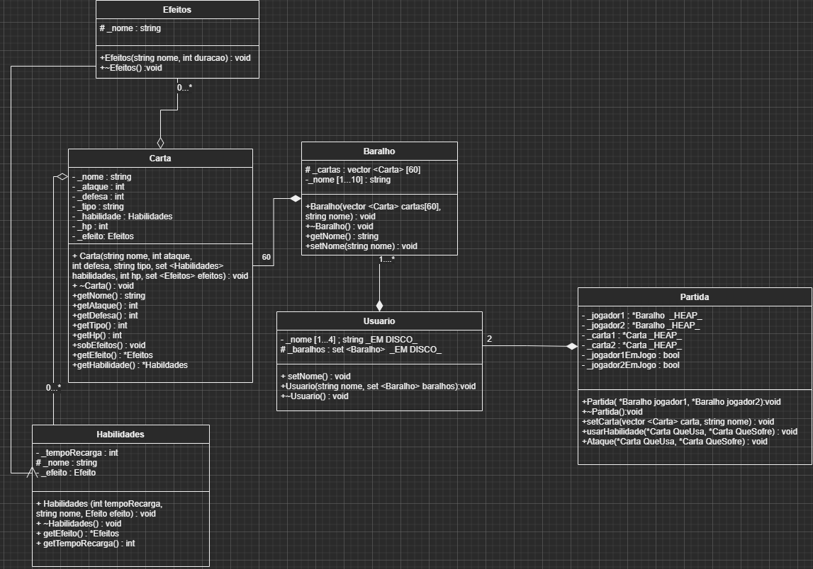

# Projeto Pds 2 :: POKEMON

## Funcionamento geral

  Esse projeto tem como principal objetivo o gerar de uma simulação de uma partida do jogo de cartas *pokemon*. Para isso...

## Classes

  Para que esse projeto seja funcional, realizamos a confecção de um diagrama de classes que representa cada uma das classes utilizadas no programa.

*Essas classes são divididas em Cartas, Baralho, Usuario e Partida, e elas serão explicadas a seguir*

### Cartas
#### Variaveis
#### Metodos

### Baralho
#### Variaveis
#### Metodos

### Usuario
#### Variaveis
#### Metodos

### Partida
#### Variaveis
#### Metodos
