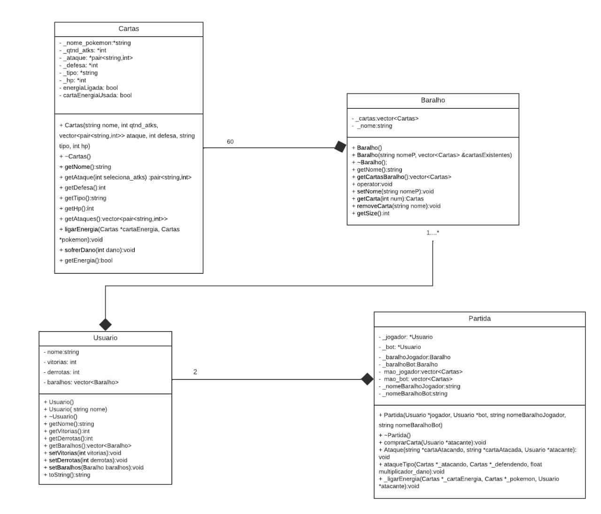

# Projeto Pds 2 :: POKEMON

O jogo de cartas Pokémon, funciona de maneira que, dois jogadores (cada um com seu baralho, os baralhos são compostos de 60 cartas Pokémon, que contém um número de ataque, um de defesa e um de vida) entram em batalha. No início da partida os baralhos de cada um são embaralhados, e logo em seguida são retiradas 6 cartas de cada baralho e postas na mesa viradas para baixo (essas são as cartas prêmio, cada jogador tem 6 que ficam na mesa, e cada um receberá uma delas assim que ele eliminar um Pokémon inimigo). Em seguida, tira-se na moeda quem irá começar o jogo, aí são dadas 7 cartas pra cada jogador (tiradas de seus respectivos baralhos), e ambos os jogadores escolhem uma das suas 7 cartas pra começar batalhando. O jogador que venceu na moeda começa jogando, ele “come” uma carta e começa atacando, e então, compara o valor de ataque do Pokémon dele com o valor de defesa do Pokémon do oponente. E então o resultado dessa subtração é descontada na vida do Pokémon inimigo (que está sendo atacado), e segue esse ciclo. Toda vez que um Pokémon é derrotado uma das 6 cartas prêmio que ficam viradas na mesa é entregue ao jogador que derrotou o Pokémon, e isso acontece até que algum dos dois ganhe as 6 cartas. 

## Funcionamento geral

  Esse projeto tem como principal objetivo o gerar de uma simulação de uma partida do jogo de cartas *pokemon*. Para isso, os jogadores, definidos na classe usuários, iniciam a partida sorteando quem irá começar a jogada. Os jogadores compram uma quantidade definida de cartas dentro do monte, definido na classe baralho.  Em seguida, ele coloca um Pokémon dentre esses da quantidade de cartas que possui para estar ativo no jogo, enquanto os outros ficam disponíveis caso o mesmo morra. E ao chegar na vez de cada jogador, este compra uma carta do monte, e pode atacar o oponente. Ganha o jogo, o jogador que consegue matar os Pokémon do adversário. 

## Classes

  Para que esse projeto seja funcional, realizamos a confecção de um diagrama de classes que representa cada uma das classes utilizadas no programa.

*Essas classes são divididas em Cartas, Baralho, Usuario e Partida, e elas serão explicadas a seguir*

### Cartas

A classe cartas é responsável por criar as cartas de cada tipo de Pokémon, e por isso, ela recebe os parâmetros relacionado as características desses pokémons.  A classe possui também um construtor, que adiciona um “valor” a cada parâmetro, consequentemente, possui também um destrutor. Possui os métodos get e algumas funções. A função  void ligarEnergia, que acessa e “liga” a energia para o Pokémon, a função void sofrerdano, no qual, intuitivamente, diz que o Pokémon sofre o dano. 

#### Atributos

string *_nome_pokemon;
int *_qtnd_atks;
vector<pair<string,int>> _ataque;
int *_defesa;
string *_tipo;
int *_hp;
bool energiaLigada;
bool cartaEnergiaUsada;
  
#### Metodos

Cartas(string nome, int qtnd_atks, vector<pair<string,int>> ataque, int defesa, string tipo, int hp);
Cartas(string tipo);
~Cartas();
string getNome();
pair<string,int> getAtaque(int seleciona_atks);
int getDefesa();
string getTipo();
int getHp();
vector<pair<string,int>> Cartas::getAtaques();
void ligarEnergia(Cartas *cartaEnergia, Cartas *pokemon);
void sofrerDano(int dano);
bool getEnergia();

### Baralho

A classe baralho é responsável por representar baralhos de cartas Pokémon, utilizando a classe carta para formular um vector de carta associado a um nome em forma de string. Possui dois tipos de construtores, um que constrói um baralho nulo/vazio e outro que constrói um novo baralho a partir de cartas já existentes, um destrutor que limpa o nome e o vetor do baralho. Além disso possui funções get e set para receber e modificar parâmetros da classe, além de uma sobrecarga de operador que permite igualar dois objetos 

#### Atributos

vector<Cartas> _cartas;
string _nome;

#### Metodos

Baralho();
Baralho(string nomeP, vector<Cartas> &cartasExistentes);
~Baralho();
string getNome();
vector<Cartas> getCartasBaralho();
void operator = (Baralho &operando);
void setNome(string nomeP);
Cartas getCarta(int num);
void removeCarta(string nome);
int getSize();

### Usuario

A classe usuário, é responsável por definir os “dados” sobre o jogador, ela define o nome do usuário, a quantidade de vitórias e de derrotas. E também herda de baralho, e implementa o baralho que o mesmo possui. 

#### Atributos

string nome;
int vitorias;
int derrotas;
vector<Baralho> baralhos;

#### Metodos

Usuario();
Usuario(std::string nome);
~Usuario();
string getNome();
int getVitorias();
int getDerrotas();
vector<Baralho> getBaralhos();
void setVitorias(int vitorias);
void setDerrotas(int derrotas);
void setBaralhos(Baralho baralhos);
string toString();

### Partida

Essa classe gerencia o sistema de combate, todo o sistema envolvido a partir do momento em que dois jogadores entram em batalha. Ou seja, ela gerencia o embaralhamento e manuseio do baralho como a parte de “comer” uma nova carta e a de retirar uma carta da mão do jogador e a de dar uma carta prêmio, ela gerencia a mudança de rodada na alternância entre a vez de cada jogador, a comparação entre o ataque e defesa e vida do Pokémon que ataca e do que defende e etc. 

#### Atributos

Usuario *_jogador;
Usuario *_bot;
Baralho _baralhoJogador;
Baralho _baralhoBot;
vector<Cartas> mao_jogador;
vector<Cartas> mao_bot;
string _nomeBaralhoJogador, _nomeBaralhoBot;

#### Metodos

Partida(Usuario *jogador, Usuario *bot, string nomeBaralhoJogador, string nomeBaralhoBot);
~Partida();
void comprarCarta(Usuario *atacante);
void Ataque(string *cartaAtacando, string *cartaAtacada, Usuario *atacante);     
void ataqueTipo(Cartas *_atacando, Cartas *_defendendo, float multiplicador_dano); 
void _ligarEnergia(Cartas *_cartaEnergia, Cartas *_pokemon, Usuario *atacante);
